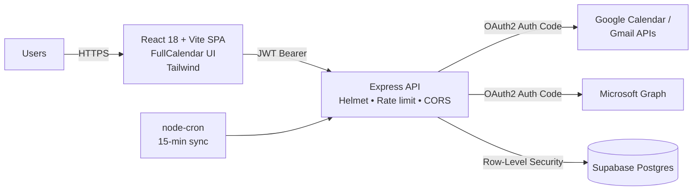

**Full-stack shared-schedule dashboard that aggregates events from multiple Google and Microsoft calendars into a single color-coded view — built with OAuth2 (PKCE-ready), JWT sessions, and Supabase Postgres with Row-Level Security.**

     

---

## Problem

Households, small teams, and extended families routinely live across **multiple calendar providers** — a Google personal account, a Google Workspace work account, a Microsoft 365 account. Seeing everyone's real availability in one place normally means either switching apps constantly or handing sensitive credentials to a third-party SaaS.

## Solution

`mb-ss-dashboard` is a self-hostable app that pulls events from connected Google and Microsoft accounts via each provider's API, normalizes and categorizes them, and renders a unified multi-user calendar — while keeping credentials and tokens inside **your own** Supabase instance with Row-Level Security enforcing per-user isolation.

---

## Architecture



---

## Features

- **Multi-account aggregation** — connect any number of Google and Microsoft accounts per user.
- **Color-coded users** — distinct color per connected account so conflicts are obvious.
- **Smart categorization** — events auto-tagged as `work`, `gym`, `appointment`, etc. via user-defined auto-rules.
- **Month / week / day views** powered by FullCalendar.
- **Filter by person or category** — instant client-side filtering.
- **Background sync** — 15-minute incremental `node-cron` job with manual-sync trigger.
- **Interactive event modal** — view details, source account, and category inline.
- **Account management** — connect, disconnect, and rename linked accounts from the UI.

---

## Security Architecture

This is the part that makes the project a **security portfolio piece**, not just a calendar app:

| Control | Implementation |
|---|---|
| OAuth2 Authorization Code Flow | PKCE-ready; tokens never touch the SPA |
| Session management | Stateless JWT; short access-token lifetime |
| Credential storage | Provider refresh tokens stored in Supabase Postgres with encryption at rest |
| Database authorization | Row-Level Security (RLS) on every table — a user can only read rows they own |
| HTTP hardening | [Helmet.js](https://helmetjs.github.io/) for standard security headers |
| Rate limiting | `express-rate-limit` — 100 requests / 15 min per IP |
| CORS | Origin allowlist, credentials-aware |
| Secret handling | 12-factor `.env` isolation; no secrets in source |

**Planned hardening**: AES-256 at the application layer for refresh tokens, 2FA on the app's own user accounts, PKCE on all OAuth flows, optional SSO (OIDC) for the app itself.

---

## Tech Stack

| Layer | Technology | Purpose |
|-------|-----------|---------|
| Frontend | React 18 + Vite | SPA with hot module replacement |
| Calendar UI | FullCalendar | Production-grade interactive calendar (month/week/day views) |
| Styling | Tailwind CSS | Utility-first responsive design |
| Backend | Node.js + Express | REST API server with middleware pipeline |
| Database | Supabase (PostgreSQL) | Managed database with built-in RLS and real-time subscriptions |
| Google Integration | googleapis SDK | OAuth2 + Calendar API + Gmail API |
| Auth | JSON Web Tokens (jsonwebtoken) | Stateless authentication |
| Scheduling | node-cron | Automated periodic calendar sync |
| Deployment | Vercel (frontend) + Railway (backend) | CI/CD from GitHub with environment isolation |

---

## Architecture

```
┌─────────────────────────────────────────────────┐
│  FRONTEND — React + Vite + Tailwind CSS         │
│  Deployed on Vercel (free tier)                  │
│                                                  │
│  • FullCalendar with month/week/day views        │
│  • Color-coded events (MB=blue, SS=pink)         │
│  • Add/edit/delete events via modals             │
│  • OAuth account connection UI                   │
│  • Person and category filtering                 │
└────────────────────┬────────────────────────────┘
                     │ REST API (JWT-authenticated)
                     ▼
┌─────────────────────────────────────────────────┐
│  BACKEND — Node.js + Express                     │
│  Deployed on Railway (free tier)                 │
│                                                  │
│  • OAuth2 flows (Google + Microsoft)             │
│  • Token refresh + encrypted storage             │
│  • Calendar sync with smart categorization       │
│  • Webhook receivers for push notifications      │
│  • Cron job for periodic background sync         │
│  • Rate limiting + security headers              │
└────────────────────┬────────────────────────────┘
                     │
        ┌────────────┼────────────┐
        ▼            ▼            ▼
  ┌──────────┐ ┌──────────┐ ┌──────────┐
  │ Google   │ │ Microsoft│ │ Supabase │
  │ Calendar │ │ Graph    │ │ PostgreSQL│
  │ Gmail    │ │ Outlook  │ │ with RLS │
  └──────────┘ └──────────┘ └──────────┘
```

---

## Features

- **Multi-account calendar aggregation** — Connect multiple Gmail and Outlook accounts per user
- **Real-time sync** — Automatic 15-minute background sync with incremental updates via syncTokens
- **Smart auto-categorization** — Events are automatically tagged (work, gym, meal prep, bills, vacation, appointments) based on title and location pattern matching
- **Color-coded by person** — MB events in blue (#4d96ff), SS events in pink (#f472b6), shared events in purple (#c084fc)
- **Interactive modals** — Click any day to add events, click any event to view/edit/delete
- **Person filtering** — Toggle between All, MB, SS, or Both views
- **Month/Week/Day views** — Full calendar navigation with today indicator
- **Manual sync trigger** — Force a sync on demand via the dashboard
- **Settings page** — Connect/disconnect Google and Outlook accounts with one click

---

## Database Schema

Four tables with Row-Level Security enabled on all:

- **users** — Application users (MB and SS) with unique email constraints
- **connected_accounts** — OAuth credentials per provider per user, with access/refresh tokens, expiration tracking, and sync state
- **events** — Unified event store with provider deduplication via unique constraint on (provider, external_id)
- **auto_rules** — Configurable recurring event rules with JSON-based recurrence definitions

Indexes on start_time, user_id, person, category, and the provider/external_id composite for query performance.

---

## The Build Journey — Step by Step

This project was built over multiple sessions, from zero to production. Here's the honest, unfiltered timeline including every mistake and how it was resolved.

### Phase 1: Foundation (Session 1)

**Goal:** Scaffold the full-stack project and connect to a database.

**Step 1 — Install Node.js**
Started by trying to run `npm create vite@latest` and got `npm: command not found`. Node.js wasn't installed.

> **Mistake #1:** Assumed Node.js was pre-installed on macOS. It isn't.
> **Fix:** Installed via Homebrew: `brew install node`

**Step 2 — Create the React frontend**
```bash
mkdir mb-ss-dashboard
cd mb-ss-dashboard
npm create vite@latest client -- --template react
cd client && npm install && npm run dev
```
Vite started successfully on `localhost:5173`.

**Step 3 — Create the Express backend**
```bash
mkdir server && cd server
npm init -y
npm install express cors helmet dotenv googleapis @azure/msal-node @microsoft/microsoft-graph-client @supabase/supabase-js jsonwebtoken node-cron express-rate-limit
```
Got "30 packages looking for funding" — this is normal npm behavior, not an error.

**Step 4 — Download and extract starter code**
Generated server boilerplate (routes, middleware, config, services) and downloaded as a zip.

> **Mistake #2:** Tried to `unzip` the file but macOS had auto-extracted it. The zip didn't exist as a `.zip` file anymore.
> **Fix:** Used `find ~/Downloads -name "app.js"` to locate where macOS extracted the files, then `cp -r` to the project directory.

> **Mistake #3:** Hidden files (`.env.example`) didn't copy with the wildcard `cp -r *` command because dotfiles are excluded by default in bash globbing.
> **Fix:** Explicitly copied: `cp ~/Downloads/mb-ss-dashboard/server/.env.example ~/mb-ss-dashboard/server/`

> **Mistake #4:** The `package.json` from `npm init` didn't have the right scripts or dependencies. A separate `package-override.json` was generated but not renamed.
> **Fix:** `cp package-override.json package.json` then `npm install`

**Step 5 — Set up Supabase**
- Created a Supabase project at supabase.com
- Ran the SQL schema in the SQL Editor (creates all 4 tables, indexes, RLS policies, and default data)
- Copied Project URL, anon key, and service role key into `.env`

> **Mistake #5:** Opened `.env~` (backup file) instead of `.env` in nano. The tilde at the end is a nano artifact.
> **Fix:** Made sure to run `nano ~/mb-ss-dashboard/server/.env` with no tilde.

**Step 6 — Verify the stack**
- Backend running on `localhost:3001` with ASCII banner
- `GET /health` returns `{"status":"ok"}`
- `GET /auth/me` returns `{"error":"Access token required"}` — auth middleware working
- Frontend running on `localhost:5173` with default Vite page

> **Phase 1 complete.** Full-stack connected: React frontend, Express backend, Supabase PostgreSQL database.

---

### Phase 2: Google Calendar Integration (Session 2)

**Goal:** OAuth2 flow with Google, sync real calendar events into the database.

**Step 1 — Google Cloud Console setup**
- Created project "mb-ss-dashboard" in Google Cloud Console
- Enabled Google Calendar API, Gmail API, and Google People API
- Configured OAuth consent screen (External user type)
- Created OAuth 2.0 Client ID (Web application) with redirect URI `http://localhost:3001/auth/google/callback`
- Saved Client ID and Client Secret to `.env`

**Step 2 — Test the OAuth flow**
Generated a JWT by calling the login endpoint:
```bash
TOKEN=$(curl -s -X POST http://localhost:3001/auth/login \
  -H "Content-Type: application/json" \
  -d '{"email":"user@outlook.com","displayName":"MB"}' | grep -o '"token":"[^"]*"' | cut -d'"' -f4)
```

Then requested the Google auth URL:
```bash
curl http://localhost:3001/auth/google -H "Authorization: Bearer $TOKEN"
```

> **Mistake #6:** First attempt to use the token got "expired error" because the token string was mangled during copy-paste (line break inserted).
> **Fix:** Used shell variable assignment (`TOKEN=$(...)`) to capture and reuse the token cleanly without copy-paste issues.

> **Mistake #7:** Google OAuth returned "Access blocked: MB SS Dashboard has not completed the Google verification process. Error 403: access_denied."
> **Fix:** Had to add the Gmail address as a **test user** in Google Cloud Console → APIs & Services → OAuth consent screen → Audience → Test users. Apps in "Testing" mode only allow explicitly listed test users.

**Step 3 — Paused and resumed two weeks later**

> **Mistake #8:** Came back after ~12 days and the backend threw `getaddrinfo ENOTFOUND lzsgmkmelcujwcngfvym.supabase.co`. Supabase free tier pauses projects after 7 days of inactivity.
> **Fix:** Logged into Supabase dashboard, clicked "Restore" to unpause the project. Took about 30 seconds. Note: once deployed with a cron job pinging every 15 minutes, this never happens again.

> **Mistake #9:** Claude Code (AI terminal assistant) tried to "fix" the DNS error by editing `auth.js` to normalize email casing. This was a red herring — the real problem was the paused database.
> **Lesson:** When using AI coding tools, understand the root cause before accepting suggested code changes. Not every error needs a code fix — sometimes it's infrastructure.

**Step 4 — Successful OAuth connection**
After restoring Supabase and adding the test user, the full OAuth flow worked:
1. Login → get JWT
2. Hit `/auth/google` → get Google consent URL
3. Open URL → authorize in Google
4. Redirect back to app → tokens saved in `connected_accounts` table
5. Verified in Supabase Table Editor: row with `provider: google`, email, access_token, refresh_token all populated.

**Step 5 — Sync calendar events**
```bash
curl -X POST http://localhost:3001/api/sync/all \
  -H "Authorization: Bearer $TOKEN" \
  -H "Content-Type: application/json"
```
Server output: `[Google] malcolmtbell@gmail.com: +49 upserted, -0 deleted`

49 real Google Calendar events synced to Supabase with auto-categorization (flights tagged as vacation, gym sessions tagged as gym, etc.).

> **Phase 2 complete.** Google OAuth working, real calendar data syncing and auto-categorized.

---

### Phase 4: Frontend Dashboard (Session 2, continued)

**Goal:** Build the interactive calendar UI with real data.

**Step 1 — Used Claude Code to scaffold the entire frontend**
Gave Claude Code a detailed prompt specifying:
- FullCalendar with month/week/day views
- Color-coding by person (MB=blue, SS=pink, both=purple)
- Login page, dashboard page, settings page
- Tailwind CSS with colorful aesthetic

Claude Code generated all React components, installed dependencies (react-router-dom, FullCalendar, axios, Tailwind), and configured Vite with API proxy.

**Step 2 — Dashboard loaded with real events**
Opened `localhost:5174` (Vite used port 5174 because 5173 was still occupied by the old instance). Logged in as MB, and all 49 Google Calendar events appeared on the calendar in blue.

> **Mistake #10:** Clicking on calendar days or events did nothing — no modals for adding or editing events.
> **Fix:** Had Claude Code add dateClick and eventClick handlers to FullCalendar, plus Add Event and Event Detail modals with full CRUD operations.

**Step 3 — Connected second user (SS)**
- Added SS's Gmail as a test user in Google Cloud Console
- Created SS user via login endpoint
- Ran the OAuth flow for SS's Google account
- Synced SS's events — appeared in pink on the dashboard

> **Mistake #11:** Birthday event (May 5) showed on May 4 in the calendar grid, but the modal correctly showed May 5.
> **Fix:** Timezone issue — FullCalendar was rendering in UTC instead of local time. Set `timeZone: 'local'` in FullCalendar configuration.

> **Phase 4 complete.** Fully interactive dashboard with real data from two Google accounts, color-coded, with CRUD modals.

---

## Lessons Learned

1. **macOS doesn't ship with Node.js** — always verify dev environment prerequisites before starting
2. **Hidden dotfiles don't copy with wildcards** — `cp -r *` skips `.env` files; copy them explicitly
3. **Google OAuth "Testing" mode requires explicit test users** — won't allow even the developer's own account without adding it to the test user list
4. **Free-tier databases pause on inactivity** — Supabase pauses after 7 days with no API calls; a background cron job solves this permanently
5. **AI coding assistants can misdiagnose infrastructure problems as code bugs** — always understand the root cause before accepting suggested changes
6. **Timezone handling is critical** — store everything in UTC, but configure frontend libraries to display in local time
7. **Copy-paste breaks tokens** — use shell variables to capture and reuse long strings like JWTs instead of manual copy-paste
8. **Phase your builds** — breaking a project into foundation → auth → integration → UI → deploy keeps complexity manageable and lets you verify each layer independently

---

## Setup & Installation

### Prerequisites
- Node.js v18+
- npm
- Git
- Google Cloud Console account
- Supabase account

### 1. Clone and install
```bash
git clone https://github.com/yourusername/mb-ss-dashboard.git
cd mb-ss-dashboard

# Install backend
cd server
npm install
cp .env.example .env

# Install frontend
cd ../client
npm install
```

### 2. Set up Supabase
1. Create a project at [supabase.com](https://supabase.com)
2. Run `server/schema.sql` in the SQL Editor
3. Copy Project URL, anon key, and service role key into `server/.env`

### 3. Set up Google OAuth
1. Create a project at [console.cloud.google.com](https://console.cloud.google.com)
2. Enable Google Calendar API, Gmail API, Google People API
3. Configure OAuth consent screen (External, add test users)
4. Create OAuth 2.0 Client ID (Web application)
5. Add redirect URI: `http://localhost:3001/auth/google/callback`
6. Copy Client ID and Client Secret into `server/.env`

### 4. Run locally
```bash
# Terminal 1 — Backend
cd server && npm run dev

# Terminal 2 — Frontend
cd client && npm run dev
```

### 5. Connect your calendar
```bash
# Get a JWT
TOKEN=$(curl -s -X POST http://localhost:3001/auth/login \
  -H "Content-Type: application/json" \
  -d '{"email":"your@email.com","displayName":"MB"}' | grep -o '"token":"[^"]*"' | cut -d'"' -f4)

# Get Google auth URL and open it
open "$(curl -s http://localhost:3001/auth/google \
  -H "Authorization: Bearer $TOKEN" | grep -o '"authUrl":"[^"]*"' | cut -d'"' -f4)"

# After authorizing, sync events
curl -X POST http://localhost:3001/api/sync/all \
  -H "Authorization: Bearer $TOKEN" \
  -H "Content-Type: application/json"
```

---

## API Endpoints

### Authentication
| Method | Endpoint | Description |
|--------|----------|-------------|
| POST | /auth/login | Login/register with email + displayName, returns JWT |
| GET | /auth/me | Get current authenticated user |
| GET | /auth/google | Initiate Google OAuth2 flow (requires JWT) |
| GET | /auth/google/callback | Google OAuth2 callback (handles token exchange) |
| GET | /auth/microsoft | Initiate Microsoft OAuth2 flow (requires JWT) |
| GET | /auth/microsoft/callback | Microsoft OAuth2 callback |

### Events (all require JWT)
| Method | Endpoint | Description |
|--------|----------|-------------|
| GET | /api/events | List events with optional filters (?person, ?category, ?start, ?end) |
| POST | /api/events | Create a manual event |
| PUT | /api/events/:id | Update an event |
| DELETE | /api/events/:id | Delete an event |

### Sync (requires JWT)
| Method | Endpoint | Description |
|--------|----------|-------------|
| POST | /api/sync | Sync a specific connected account |
| POST | /api/sync/all | Sync all connected accounts |

### Accounts (require JWT)
| Method | Endpoint | Description |
|--------|----------|-------------|
| GET | /api/accounts | List connected accounts |
| DELETE | /api/accounts/:id | Disconnect an account |

---

## Cost

| Service | Tier | Monthly Cost |
|---------|------|-------------|
| Vercel | Hobby (free) | $0 |
| Railway | Starter | $0–$5 |
| Supabase | Free | $0 |
| Google Calendar API | Free | $0 |
| Microsoft Graph API | Free | $0 |
| **Total** | | **$0–$5/month** |

---

## Future Enhancements

- [ ] Microsoft Outlook calendar integration (Phase 3 — OAuth flow scaffolded, needs Azure AD app registration)
- [ ] Push notifications via Google Calendar webhooks and Microsoft Graph subscriptions
- [ ] Auto-populate recurring events from configurable rules
- [ ] Gmail/Outlook email scanning for flight confirmations, bill reminders, and appointment bookings
- [ ] Mobile-responsive progressive web app (PWA) with install prompt
- [ ] Two-factor authentication for app login
- [ ] Token encryption at rest using AES-256

---
## Why this is a security portfolio project

Even though the surface use case is a calendar dashboard, the interesting work is all defense-adjacent:

- **Threat modeling** — STRIDE walkthrough of the OAuth surface, the JWT lifecycle, and the multi-tenant data layer.
- **Data-layer authorization** — RLS moves the authorization boundary out of application code and into the database, eliminating "missing where-clause" bug classes.
- **Defense in depth** — Helmet + rate limiting + CORS allowlist + RLS + JWT expiration all stack.
- **Real-world OAuth** — handling refresh tokens, scope narrowing, and consent-screen scope reduction.

---

## License

MIT — see [LICENSE](LICENSE).

---

## Author

**Malcolm T. Bell** — Portfolio: [github.com/malcolmtyronebell](https://github.com/malcolmtyronebell)
